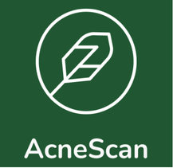

# AcneScan 1.0 - First Public Release
## Release Date: December 12, 2024

---

## Overview
AcneScan is an Android application designed to help users identify acne types on their face and provide skincare guidance based on their skin condition. It also offers useful articles about skincare and links to recommended products for each acne type.

## Key Features:
1. Facial Acne Scanning
   Detects different types of acne using advanced image recognition technology.
Categorizes acne into 5 distinct types for personalized treatment suggestions.

2. Skincare Articles
   A collection of articles that provide valuable skincare tips, routines, and advice for managing acne.

3. Product Recommendations
   For each of the 5 acne types, users are given links to skincare products that may help improve their condition.
   
5. User-Friendly Interface
   Simple and intuitive design to make acne scanning and skincare advice easily accessible.

---

## What's New in Version 1.0:
1. First Stable Release:
AcneScan is now available for public download! The app offers real-time facial acne scanning, categorization of acne types, and personalized skincare recommendations.

2. Skincare Articles Section:
A growing collection of informative articles on how to maintain healthy skin and prevent acne flare-ups.

3. Product Recommendations:
Direct links to recommended products tailored to the specific acne types detected.

---

## Installation
The scanning accuracy may vary based on lighting conditions and the quality of the image provided.
Some users may experience delays in receiving product recommendations based on server load.
Installation Instructions:
1. Download the APK from the Releases Page.
2. Enable installation from unknown sources in your Android settings.
3. Install the APK file.
4. Open the app and start scanning!

---

## License
AcneScan is released under the MIT License. See the LICENSE file for more information.
